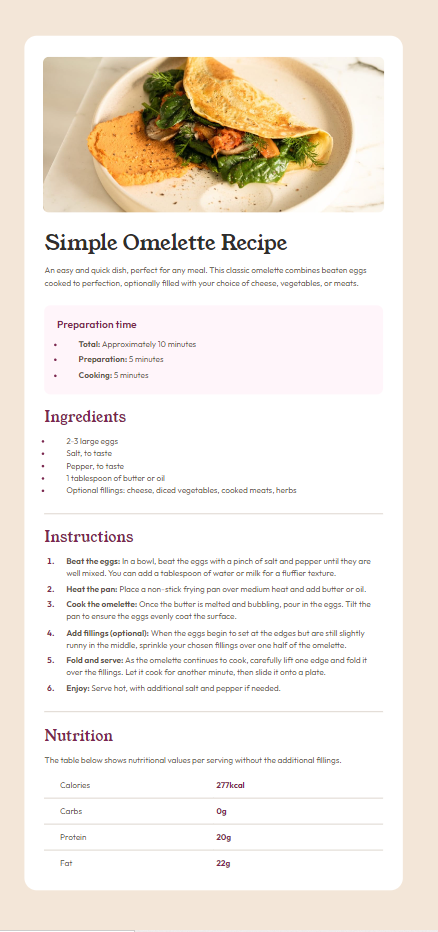

# Frontend Mentor - Recipe page solution

This is a solution to the [Recipe page challenge on Frontend Mentor](https://www.frontendmentor.io/challenges/recipe-page-KiTsR8QQKm). Frontend Mentor challenges help you improve your coding skills by building realistic projects. 

## Table of contents

- [Overview](#overview)
  - [The challenge](#the-challenge)
  - [Screenshot](#screenshot)
  - [Links](#links)
- [My process](#my-process)
  - [Built with](#built-with)
  - [Useful resources](#useful-resources)

## Overview

### Screenshot

### Links

- Solution File: [Solution File](index.html)

## My process
1. Sketch out design on paper. Label elements using semantic tags.
2. Make html file with sections as per sketch.
3. Create CSS file with resets, custom properties.
4. Apply fonts, colors and aesthetic features to the elements.
5. Apply layout, positioning to elements.
6. Generous tweaking to match design as closely as possible.
7. Make adjustments to achieve desktop design on larger screens.
8. Fiddle and tweak a lot more.
9. Reach a point where I'm sick of fiddling and it looks good enough.
10. Final commit, edit this readme file.

### Built with

- Semantic HTML5 markup
- CSS custom properties
- Flexbox
- CSS Grid
- Mobile-first workflow

### Useful resources

- MDN
- Codepen (for quickly trying out a concept on its own)

